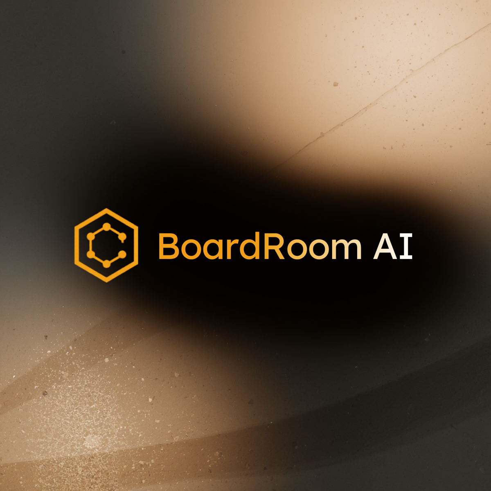

<p align="center">
  
</p>

<h1 align="center">BoardRoom AI + OmniMind Platform</h1>

<p align="center">
  <strong>Your AI-powered executive team.</strong><br />
  Multi-persona decision intelligence that remembers your context, challenges your thinking, and keeps you aligned.
</p>

<p align="center">
  <a href="#quick-start">Quick Start</a> ·
  <a href="#architecture">Architecture</a> ·
  <a href="docs/MASTER-FRAMEWORK.md">Spec</a> ·
  <a href="docs/tasks/BRAND-SYSTEM.md">Brand</a>
</p>

---

## What it does

- **Seven-persona advisory board.** Optimist, Critic, Alternate, Technician, Questionnaire, Doer, and a CEO that synthesizes them — each with its own model, context slice, and output contract.
- **Persistent cognitive memory.** Every decision, commitment, and insight is validated, embedded, and retrievable via a hybrid (structured + FTS + trigram + vector) pipeline.
- **Onboarding bootstrap.** Skip the 5-step wizard. Hand your AI of choice a dense briefing prompt, drop the response back, and BoardRoom populates the whole profile in one shot.
- **Warm gold brand system.** Full light/dark token system with a dark sidebar that's intentional regardless of theme.

## Quick Start

```bash
# Prerequisites: Node.js 20+, Docker & Docker Compose

# Option 1: Automated setup (recommended)
./scripts/dev-setup.sh

# Option 2: Manual setup
# 1. Clone and install dependencies
npm install

# 2. Setup environment
cp .env.example .env
# Edit .env and add your API keys

# 3. Start services with Docker Compose
docker-compose up
# OR for development with hot reload:
docker-compose -f docker-compose.dev.yml up

# 4. Run database migrations
cd packages/omnimind-api
pnpm exec prisma migrate dev
```

## Docker Compose Options

The platform includes multiple Docker Compose configurations for different use cases:

- **`docker-compose.yml`** - Production-like setup with built containers
- **`docker-compose.dev.yml`** - Development setup with hot reload and mounted source code
- **`docker-compose.test.yml`** - Test environment with mocked APIs

### Services Included

All configurations include:
- **PostgreSQL 16** with pgvector extension for vector embeddings
- **Redis 7** for caching and session storage
- **OmniMind API** - Memory & data layer (port 3333)
- **BoardRoom AI** - UI & persona orchestration (port 3001)

### Development with Hot Reload

For the best development experience with automatic code reloading:

```bash
# Start development environment
docker-compose -f docker-compose.dev.yml up

# Access services:
# - BoardRoom AI: http://localhost:3001
# - OmniMind API: http://localhost:3333  
# - PostgreSQL: localhost:5432
# - Redis: localhost:6379
```

## Architecture

```
boardroom-platform/
├── packages/shared/        # Types, Zod schemas, constants
├── packages/omnimind-api/  # Memory & data layer (Express + Prisma)
├── packages/boardroom-ai/  # UI + persona orchestration (React + Express)
├── docs/                   # Specs, contracts, prompts, tasks
└── eval/                   # Golden test suite
```

**OmniMind** owns all persistent data. **BoardRoom** owns UX and persona orchestration. They communicate via HTTP.

## Documentation

- [Master Framework](docs/MASTER-FRAMEWORK.md) — Complete product + technical spec
- [Decisions Log](docs/DECISIONS.md) — All architectural decisions with rationale
- [Task Index](docs/tasks/_TASK-INDEX.md) — Current work status and dependencies
- [API Contracts](docs/contracts/) — Service-to-service API agreements

## Commands

| Command | Description |
|---------|-------------|
| `npm run dev` | Start all services (Turborepo) |
| `npm run build` | Build all packages |
| `npm run test` | Run all tests |
| `npm run typecheck` | Type-check all packages |
